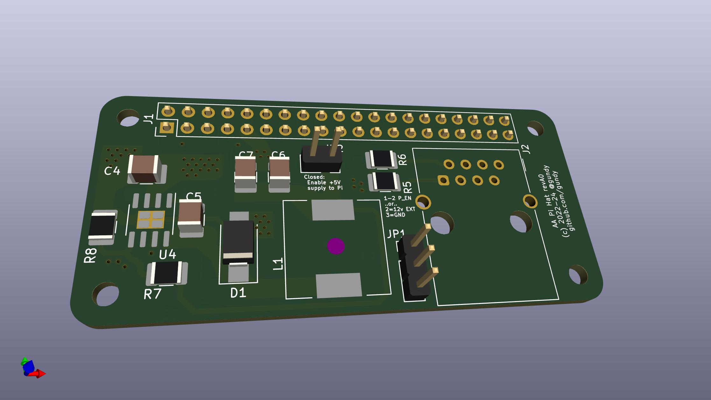

# AA PiHat for Rasperry Pi Zero 2(W)

This repository contains KiCad schematics and board designs for a module to interface with the AA control board.

# Goals

The goal is to provide a PiHat-style module that plugs into a Pi-Zero (or a regular rasperry pi), that draws power from the AA "ethernet" interface and converts it to 5V for the Raspberry Pi, and allows the Pi to communicate with the CB using the standard serial RX/TX pins.

The board has jumpers to allow the 5V supply to the Pi to be disabled if required, and also allows for supplying power via an external ~12v source rather than from the AA CB unit.

# Disclaimer

This is very much a work-in-progress. To be clear, as of initial push date, I haven't actually ordered or assembled any boards yet. This development is being done in the open in case it helps anyone else, or in case others would like to contribute.

If you'd like to contribute, please feel free to reach out.

# License

This work is licensed under the GNU General Public License v3.

