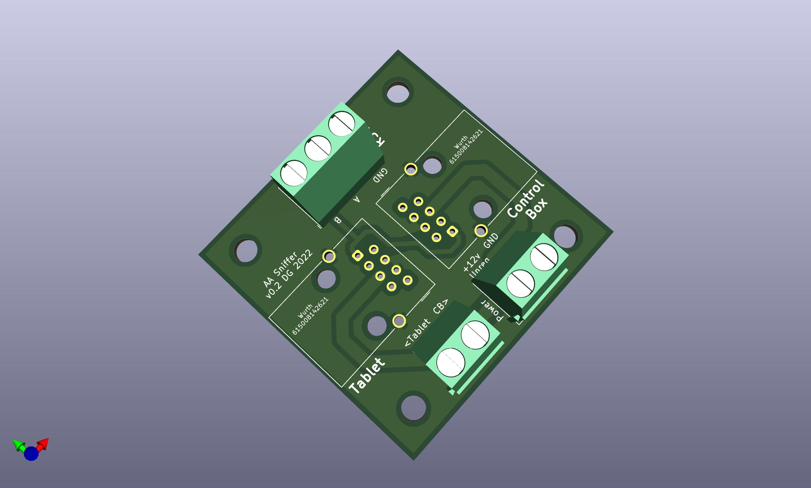

# AA RS485 interceptor board

## Description

This board can be used to intercept communications between the AA Tablet and Control Box.

It has ethernet jacks for the connection to the Control Box and the Tablet, and screw-connector taps for:

* The RS485 data lines (to be connected to an RS485 USB device)
* The 12v (14v) power lines from the Control Box.
* A bridgeable connector that can be used to disconnect the power from the tablet-side of the connection if needed.

## Disclaimer

Use this at your own risk.